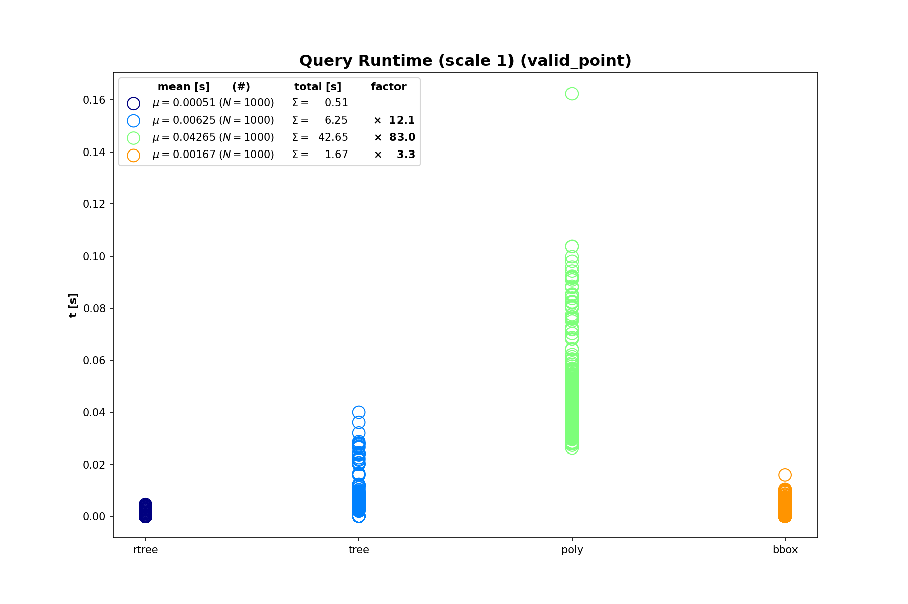
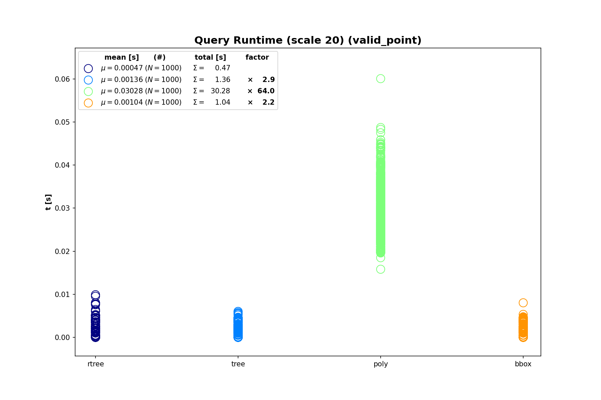
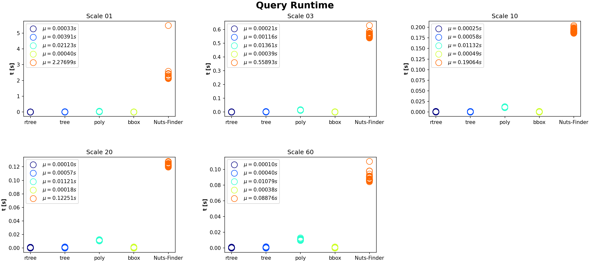

# FastPyNUTS
A fast implementation of querying the [NUTS - Nomenclature of territorial units for statistics](https://ec.europa.eu/eurostat/web/gisco/geodata/reference-data/administrative-units-statistical-units/nuts) dataset by location, particularly useful for large-scale applications.


 <br>
Figure: [_Eurostat_](https://ec.europa.eu/eurostat/documents/7116161/7117206/NUTS-layers.gif)


## Features
- fast querying of NUTS regions (~0.3ms/query)
- find all NUTS regions of a point or query user-defined NUTS-levels (0-3)
- use your own custom NUTS dataset (other CRS, enriched metadata, etc.)


## Installation
```cmd
pip install fastpynuts
```
`FastPyNUTS` requires `numpy`, `shapely`, `treelib` and `rtree`


## Usage

#### Initialization and finding NUTS regions
The `NUTSfinder` class is the main tool to determine the NUTS regions of a point. It can be initialized from a local file
containing the NUTS regions, or via automatic download from [Eurostat](https://gisco-services.ec.europa.eu/distribution/v2/nuts).
```python
from fastpynuts import NUTSfinder

# construct from local file
nf = NUTSfinder("PATH_TO_LOCAL_FILE.geojson")

# retrieve data automatically (file will be downloaded to or if already existing read from '.data')
nf = NUTSfinder.from_web(scale=1, year=2021, epsg=4326)


# find NUTS regions
point = (11.57, 48.13)
regions = nf.find(*point)                   # find all regions via a point

bbox = (11.57, 48.13, 11.62, 49.)           # lon_min, lat_min, lon_max, lat_max
regions = nf.find_bbox()                    # find all regions via a bbox

geom = {
    "type": "Polygon",
    "coordinates": [
        [
            [11.595733032762524, 48.11837184946995],
            [11.631858436052113, 48.14289890153063],
            [11.627498473585405, 48.16409081247133],
            [11.595733032762524, 48.11837184946995]
        ]
    ]
}
regions = nf.find_bbox()                    # find all regions via a GeoJSON geometry (supports shapely geometries and all objects that can be converted into one)


# filter for regions of specific levels
level3 = nf.filter_levels(regions, 3)
level2or3 = nf.filter_levels(regions, 2, 3)
```

#### Assessing the results
The NUTS regions will be returned as an ordered list of `NUTSregion` objects.
```python
>>> regions
[NUTS0: DE, NUTS1: DE2, NUTS2: DE21, NUTS3: DE212]
```

Each region object holds information about
- its ID and NUTS level
```python
>>> region = regions[0]
>>> region.id
DE
>>> region.level
0
```
- its geometry (a `shapely` Polygon or MultiPolygon) and the corresponding bounding box
```python
>>> region.geom
<MULTIPOLYGON (((10.454 47.556, 10.44 47.525, 10.441 47.514, 10.432 47.504, ...>
>>> region.bbox
(5.867697, 47.270114, 15.04116, 55.058165)
```
- further fields from the NUTS dataset and the original input feature in GeoJSON format
```python
>>> region.properties
{
    "NUTS_ID": "DE",
    "LEVL_CODE": 0,
    "CNTR_CODE": "DE",
    "NAME_LATN": "Deutschland",
    "NUTS_NAME": "Deutschland",
    "MOUNT_TYPE": 0,
    "URBN_TYPE": 0,
    "COAST_TYPE": 0,
    "FID": "DE"
}
>>> region.feature
{
    'type': 'Feature',
    'geometry': {
        'type': 'MultiPolygon',
        'coordinates': [
            [
                [
                    [10.454439, 47.555797],
                    ...
                ]
            ]
        ],
    },
    'properties': {
        "NUTS_ID": "DE",
        ...
}
```

## Advanced Usage
```python
# apply a buffer to the input regions to catch points on the boundary (for further info on the buffering, see the documentation)
nf = NUTSfinder("PATH_TO_LOCAL_FILE.geojson", buffer_geoms=1e-5)

# only load certain levels of regions (here levels 2 and 3)
nf = NUTSfinder("PATH_TO_LOCAL_FILE.geojson", min_level=2, max_level=3)


# if the point to be queried is guaranteed to lie within a NUTS region, setting valid_point to True may speed up the runtime
regions = nf.find(*point, valid_point=True)
```


## Runtime Comparison
`FastPyNUTS` is optimized for query speed and result correctness, at the expense of more expensive initialization time.

A R-tree-based approach proved to be the fastest option:
<table>
 <tr>
    <td>  </td>
    <td>  </td>
  </tr>
</table>

Compared to other packages like [nuts-finder](https://github.com/nestauk/nuts_finder), a large performance boost can be achieved



**Tips**:
- if interested only in certain levels (0-3) of the NUTS dataset, initialize the `NUTSfinder` using its `min_level` and `max_level` arguments
- if it's known beforehand that the queried point lies within the interior of a NUTS region, use `find(valid_point=True)`

For a full runtime analysis, see [benchmark.ipynb](benchmark.ipynb)


## Contributors
- [Colin Moldenhauer](https://github.com/ColinMoldenhauer/)
- [meengel](https://github.com/meengel)
